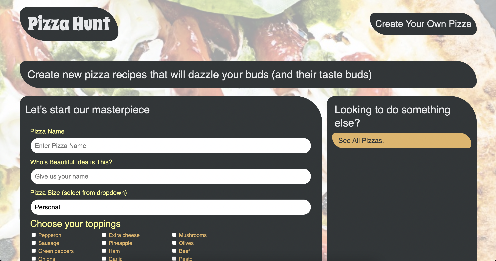

# Pizza Hunt
Social media recipe app where users can post their creative spins on pizza, add comments to recipes, and create threads within comments. To do this, you’ll add back-end functionality to an existing front end.

### Building
Instead of using a MySQL database, you’ll use MongoDB, a document-based NoSQL database, and Mongoose, an Object-Document Mapper, to work with unstructured data.

### Usage and purpose
* Integrate the API code with the client’s existing codebase.

* Create a Pizza model using Mongoose.

* Use Mongoose’s middleware to automate functionality.

* Implement Mongoose’s pre-built methods for CRUD operations.

* Complete a working front end to create a new pizza.

### Website Link
[LINK TO HEROKU](https://pizzabloglv.herokuapp.com/)

### Contact or questions
[Coleyrockin Github](https://github.com/coleyrockin)

[Coleyrockin@aol.com](mailto:coleyrockin@aol.com)

### Screenshot
